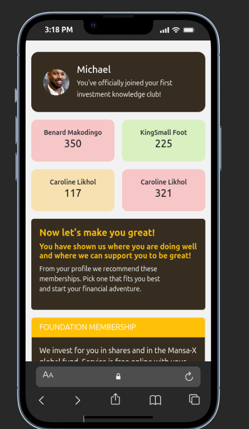

# 💼 Investment Knowledge Club UI

A responsive investment membership landing page built using:

- HTML5
- CSS3
- Bootstrap 5
- Vanilla JavaScript

This project recreates the provided design as closely as possible while following clean code structure and responsive best practices.

---

## 📌 Project Overview

This page represents a personalized investment membership dashboard.

It includes:

- 👤 Profile welcome section
- 📊 Investment statistics grid
- 📣 Recommendation section
- 🏦 Membership selection cards
- 📱 Fully responsive layout
- 🪟 Bootstrap modal interaction

---

## 🛠 Technologies Used

| Technology | Purpose |
|------------|----------|
| HTML5 | Page structure |
| CSS3 | Custom styling |
| Bootstrap 5 | Layout, responsiveness, modal |
| JavaScript | Toggle interactions |
| Bootstrap Icons | WhatsApp icon |

---

## 📱 Responsiveness

The page is fully responsive using:

- Bootstrap Grid System (`row`, `col-6`, `col-md-6`)
- Mobile-first layout approach
- Custom media queries for smaller devices
- Flexible card components

Breakpoints handled:

- Mobile (<576px)
- Tablet (≥768px)
- Desktop (≥992px)

---

## ⚡ JavaScript Interactivity

The page includes:

### 1️⃣ Membership Toggle
Clicking:

- **Foundation Membership**
- **Economy Membership**

Will reveal or hide the membership description using JavaScript class toggling.

### 2️⃣ Bootstrap Modal
A button triggers a modal showing detailed membership information.

### 3️⃣ Floating WhatsApp Button
Fixed to bottom-right corner.
Opens WhatsApp chat in a new tab.

---

## 📁 Project Structure
## investment-club-ui/
## ├──index.html
## ├── css/
## │ └── styles.css
## ├── js/
## │ └── script.js
## ├── assets/
## │ └── screenshots/
## │ ├── mobile.png
## │ └── tablet.png
## └── README.md

---

## 🖼 Screenshots

### 📱 Mobile View

---

---

## 🚀 How To Run Locally

1. Clone the repository
